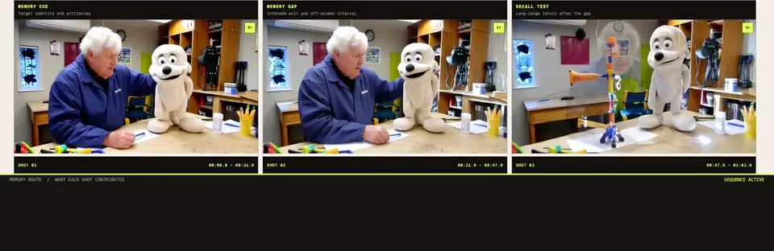
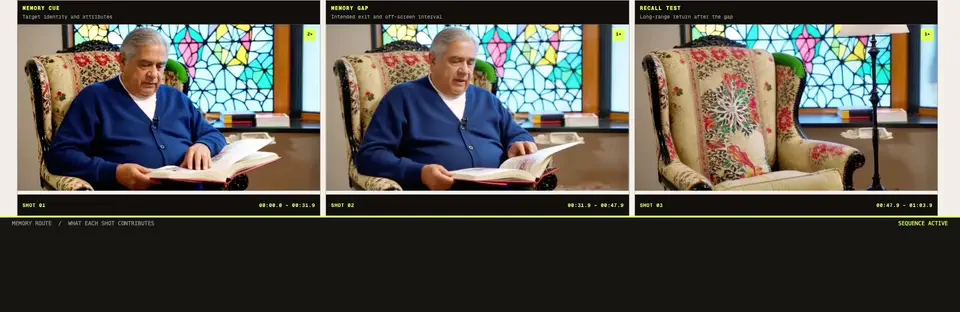
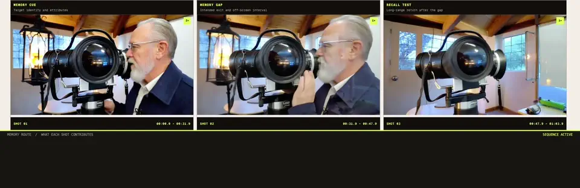
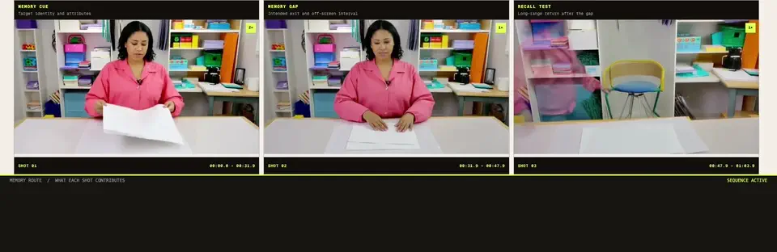
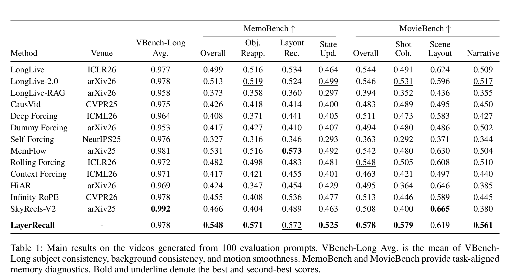

<div align="center">

# LayerRecall: A State-Conditioned Memory Router for Long-Horizon Consistency in Video Generation

Yixuan Ding<sup>1</sup>, Jiahao Kong<sup>1</sup>, Wei Huang<sup>2</sup>, Ruijie Quan<sup>1,*</sup>, Yi Yang<sup>1</sup>

<sup>1</sup>Zhejiang University &nbsp;&nbsp; <sup>2</sup>The University of Hong Kong

<sup>*</sup>Corresponding author

[](https://arxiv.org/abs/XXXX.XXXXX)
[](https://github.com/Yixuan-Ding-ZJU/LayerRecall)
[](https://yixuan-ding-zju.github.io/LayerRecall_Web/)
[](https://huggingface.co/Yixuan-Ding-ZJU/LayerRecall)

</div>

## 🔥 News

- LayerRecall paper released on arXiv.
- LayerRecall module weight released on huggingface.
- LayerRecall project page is available.

## 📖 Abstract

Autoregressive video diffusion enables scalable long-video generation by producing chunks from a bounded recent context. While recency-based caching preserves local continuity, it evicts historical cues needed when subjects, objects, scenes, or attributes reappear. Existing memory mechanisms expose models to nonlocal history, but access alone does not ensure effective use. Our analysis reveals that video DiT layers exhibit distinct preferences for current, recent, and distant context, suggesting that long-range memory requires deciding both *what to retrieve* and *where to use it*. We introduce **LayerRecall, a current-conditioned, layer-selective memory router** that retrieves relevant historical K/V states and injects them only into backbone-specific memory-sensitive layers while preserving local attention elsewhere. To reduce reliance on scarce high-quality long-horizon videos and explicit memory-allocation labels, we further propose **Cross-Horizon Prediction Matching (CHPM)**, which uses a privileged long-context reference to supervise the bounded-memory router in prediction space. Across 100 multi-shot evaluation prompts, LayerRecall achieves the best overall results on MemoBench and MovieBench while matching its backbone on VBench-Long, demonstrating stronger long-range recovery without sacrificing local continuity. Qualitative analyses further reveal memory-guided self-correction, whereby initially mismatched local attributes return to their historical appearance without resetting ongoing motion or scene structure. Additional analyses show cross-backbone portability and negligible inference overhead.

## 🎬 Quick Look

A brief selection of LayerRecall results is shown below. The previews autoplay and loop; click one to open the full-resolution MP4. Visit the [project page](https://yixuan-ding-zju.github.io/LayerRecall_Web/) for more demos.

<table>
  <tr>
    <td width="50%" align="center">
      <a href="partial_demo/showcase-01-memory-cue-recall-highlight-v2-hq.mp4"></a><br>
      <strong>Memory Cue Recall</strong> · <a href="partial_demo/showcase-01-memory-cue-recall-highlight-v2-hq.mp4">Full video</a>
    </td>
    <td width="50%" align="center">
      <a href="partial_demo/showcase-02-stained-glass-reader-memory-recall-highlight-hq.mp4"></a><br>
      <strong>Stained-Glass Reader</strong> · <a href="partial_demo/showcase-02-stained-glass-reader-memory-recall-highlight-hq.mp4">Full video</a>
    </td>
  </tr>
  <tr>
    <td width="50%" align="center">
      <a href="partial_demo/showcase-03-twilight-lighthouse-keeper-memory-recall-highlight-hq.mp4"></a><br>
      <strong>Twilight Lighthouse Keeper</strong> · <a href="partial_demo/showcase-03-twilight-lighthouse-keeper-memory-recall-highlight-hq.mp4">Full video</a>
    </td>
    <td width="50%" align="center">
      <a href="partial_demo/showcase-10-paper-craft-studio-memory-recall-highlight-hq.mp4"></a><br>
      <strong>Paper-Craft Studio</strong> · <a href="partial_demo/showcase-10-paper-craft-studio-memory-recall-highlight-hq.mp4">Full video</a>
    </td>
  </tr>
</table>

## 📊 Primary Evaluation

<p align="center">
  
</p>

---

# 🚀 Usage

## Table of Contents

- [Project Structure](#project-structure)
- [Quick Start](#quick-start)
- [LayerRecall Inference](#layerrecall-inference)
- [CHPM Training](#chpm-training)
- [Exact Resume](#exact-resume)
- [Configuration Reference](#configuration-reference)

---

## Project Structure

```text
LayerRecall/
├── README.md                              # Documentation
├── requirements.txt                      # Runtime dependencies
├── requirements-dev.txt                  # Test dependencies
├── inference.py                          # LayerRecall inference entry
├── train.py                              # Training entry
│
├── assets/                               # README figures
│
├── configs/
│   ├── paths.env.example                 # Machine-specific path template
│   ├── inference_layer_recall.yaml       # Hard/soft LayerRecall inference
│   ├── train_chpm_384_dp.yaml            # CHPM training with SP=1
│   ├── train_chpm_384_sp2.yaml           # CHPM training with SP=2
│   ├── train_chpm_384_dp_resume_smoke.yaml
│   └── train_chpm_384_sp2_resume_smoke.yaml
│
├── examples/
│   └── prompts/layerrecall_100cases/      # Released 100-case prompt bank
│       └── caption/case_XXXX/             # Three-shot structured prompts
│
├── partial_demo/                          # README quick-look videos
│
├── scripts/
│   └── train_chpm.sh                     # Single-node/multi-node launcher
│
├── model/
│   └── chpm.py                           # Teacher-student CHPM data flow
├── trainer/
│   └── chpm.py                           # Optimization and checkpointing
├── pipeline/
│   └── causal_diffusion_inference.py     # Streaming inference pipeline
├── utils/
│   ├── layer_recall.py                   # LayerRecall memory runtime
│   ├── chpm_resume.py                    # Exact-resume utilities
│   └── chpm_sp.py                        # SP/DP process groups
├── wan_5b/
│   ├── modules/causal_model.py           # LayerRecall attention integration
│   └── distributed/streaming_ulysses.py  # Training-compatible Ulysses SP
├── tools/
│   └── audit_chpm_resume.py              # Exact-resume audit
└── tests/                                # CPU, distributed, and CUDA tests
```

---

## Quick Start

### 1. Install Dependencies

The release has been validated with Python 3.10, PyTorch 2.8.0, CUDA 12.8,
and FlashAttention 2.8.3.post1.

```bash
git clone https://github.com/Yixuan-Ding-ZJU/LayerRecall.git
cd LayerRecall

conda create -n layerrecall python=3.10 -y
conda activate layerrecall

# Install PyTorch first. Change the CUDA wheel index when needed.
pip install torch==2.8.0 torchvision==0.23.0 \
  --index-url https://download.pytorch.org/whl/cu128

pip install -r requirements.txt
pip install flash-attn==2.8.3.post1 --no-build-isolation
```

Install the optional test dependencies with:

```bash
pip install -r requirements-dev.txt
```

### 2. Download Model Weights

LayerRecall requires three model assets:

1. the Wan2.2-TI2V-5B model directory, including the text encoder and VAE;
2. the LongLive2 merged generator checkpoint;
3. a LayerRecall CHPM v3 checkpoint for inference.

```bash
# Wan2.2-TI2V-5B
hf download <WAN2_2_TI2V_5B_HUGGINGFACE_REPO> \
  --local-dir <PATH_TO_WAN2_2_TI2V_5B>

# LongLive2 generator
hf download <LONGLIVE2_HUGGINGFACE_REPO> \
  <LONGLIVE2_MERGED_GENERATOR_FILENAME> \
  --local-dir <PATH_TO_LONGLIVE2_CHECKPOINT_DIRECTORY>

# LayerRecall checkpoint
hf download Yixuan-Ding-ZJU/LayerRecall \
  layer_recall_chpm_v3_step200.pt \
  --local-dir <PATH_TO_LAYERRECALL_CHECKPOINT_DIRECTORY>
```

The LayerRecall loader only accepts the released CHPM v3 checkpoint schema:
`trainer=chpm`, `checkpoint_version=3`, and a complete
`layer_recall_state_dict`.

### 3. Configure Paths and Prompts

Copy the path template to a Git-ignored local file and replace every
placeholder with a local path:

```bash
cp configs/paths.env.example .env.layerrecall
```

```bash
# .env.layerrecall
export WAN_MODEL_ROOT="<PATH_TO_WAN2_2_TI2V_5B>"
export LONGLIVE2_CHECKPOINT="<PATH_TO_LONGLIVE2_MERGED_GENERATOR_PT>"
export LAYER_RECALL_CHECKPOINT="<PATH_TO_LAYERRECALL_MODEL_PT>"

export EVAL_DATA_ROOT="$(pwd)/examples/prompts/layerrecall_100cases"
export EVAL_OUTPUT_DIR="outputs/inference"

export DATA_ROOT="<PATH_TO_CHPM_TRAINING_PROMPTS>"
```

Load the variables before inference or training:

```bash
source .env.layerrecall
```

Inference accepts either a plain text file or a structured prompt directory.
The repository includes 100 three-shot examples at:

```text
examples/prompts/layerrecall_100cases
```

Each case uses 48 streaming chunks with a `24 / 12 / 12` three-shot schedule.
The included prompt bank can therefore be used directly with the default
384-frame inference configuration.

### 4. Run LayerRecall Inference

The default configuration generates 384 latent frames and decodes them into a
1533-frame, approximately 64-second video at 24 FPS. It uses one GPU for the
DiT and one GPU for streaming VAE decoding.

Hard selection:

```bash
CUDA_VISIBLE_DEVICES=0,1 python inference.py \
  --config_path configs/inference_layer_recall.yaml \
  --layer-recall-selection-mode hard
```

Soft selection:

```bash
CUDA_VISIBLE_DEVICES=0,1 python inference.py \
  --config_path configs/inference_layer_recall.yaml \
  --layer-recall-selection-mode soft
```

Generated videos and their block-level prompt records are written to
`EVAL_OUTPUT_DIR`.

### 5. Run CHPM Training

The recommended configuration uses Streaming Ulysses with `SP=2`. For example,
six GPUs form three data-parallel replicas (`SP=2`, `DP=3`):

```bash
export CONFIG="configs/train_chpm_384_sp2.yaml"
export RUN_NAME="layerrecall_chpm_sp2"
export LOGDIR="outputs/${RUN_NAME}"
export NPROC_PER_NODE=6
export RESUME_MODE=none

bash scripts/train_chpm.sh
```

W&B is disabled by default. Enable it with `ENABLE_WANDB=1` after configuring
the project and account fields in the YAML.

---

## LayerRecall Inference

LayerRecall operates on the existing LongLive2 streaming KV cache. Memory
summaries are used only for retrieval scoring; the corresponding full cached
K/V content is passed to attention.

The released inference configuration uses:

- memory-sensitive layers: `4, 9, 10, 12, 13, 15, 16, 17, 18, 26`;
- 80 latent frames of physical KV cache;
- a 32-frame attention-visible budget;
- an 8-frame sink and an 8-frame current chunk;
- current-conditioned cosine retrieval from the historical candidate pool.

### Selection Modes

Mode | Behavior
--- | ---
`hard` | Selects the highest-scoring historical chunks and inserts their full K/V into attention.
`soft` | Forms weighted K/V memory from the candidate pool before attention.

The mode is selected with `--layer-recall-selection-mode`; no YAML edit is
required.

### Prompt Formats

**Plain text**: each non-empty line is one inference case. The same prompt is
used for all 48 streaming chunks.

```text
A cinematic tracking shot of ...
A steady close-up of ...
```

**Structured multi-shot directory**: each case contains one JSON file per shot
and an optional `shot_durations.txt` file.

```text
<PROMPT_ROOT>/
└── caption/
    └── case_0001/
        ├── 0.json
        ├── 1.json
        ├── 2.json
        └── shot_durations.txt
```

Each JSON file contains a `caption` field:

```json
{"caption": "A wide establishing shot of ..."}
```

`shot_durations.txt` specifies the number of 8-frame latent chunks assigned to
each shot. If it is absent, the 48 chunks are distributed evenly.

---

## CHPM Training

CHPM trains only the LayerRecall parameters. The LongLive2 student backbone,
long-context teacher, text encoder, and VAE remain frozen.

The formal 384-frame configuration performs:

1. a sequential 48-chunk teacher rollout;
2. a detached 48-chunk student full rollout under its own generated context;
3. one prediction anchor every 64 latent frames, for six anchors in total;
4. immediate backward at each anchor and one optimizer step per sequence.

### Conventional Distributed Training (`SP=1`)

```bash
export CONFIG="configs/train_chpm_384_dp.yaml"
export RUN_NAME="layerrecall_chpm_dp"
export LOGDIR="outputs/${RUN_NAME}"
export NPROC_PER_NODE=<NUMBER_OF_GPUS>
export RESUME_MODE=none

bash scripts/train_chpm.sh
```

Every rank processes a complete 8-frame streaming chunk. Use this mode when
each GPU has sufficient memory for the configured teacher context.

### Streaming Ulysses Training (`SP=2`)

```bash
export CONFIG="configs/train_chpm_384_sp2.yaml"
export RUN_NAME="layerrecall_chpm_sp2"
export LOGDIR="outputs/${RUN_NAME}"
export NPROC_PER_NODE=<EVEN_NUMBER_OF_GPUS>
export RESUME_MODE=none

bash scripts/train_chpm.sh
```

Each two-rank SP group processes the same current chunk and shards attention
heads, while different SP groups form data-parallel replicas. The 48 streaming
chunks remain strictly sequential.

### Multi-Node Launch

The same launcher supports fixed multi-node rendezvous. Set the following
variables on every node, changing only `NODE_RANK`:

```bash
export NNODES=<NUMBER_OF_NODES>
export NPROC_PER_NODE=<GPUS_PER_NODE>
export NODE_RANK=<CURRENT_NODE_RANK>
export MASTER_ADDR=<NODE_0_IP>
export MASTER_PORT=29500
export RDZV_ID=<SHARED_RUN_ID>
export RUN_NAME=<SHARED_RUN_NAME>
export LOGDIR=<SHARED_OUTPUT_DIRECTORY>

bash scripts/train_chpm.sh
```

Model, data, output, and checkpoint paths must be visible from every node.

---

## Exact Resume

CHPM checkpoints contain the LayerRecall parameters, optimizer state, global
step, gradient-accumulation position, per-rank RNG states, and per-rank data
stream cursors. A valid exact-resume checkpoint contains both `model.pt` and a
neighboring `COMPLETE` marker.

### Auto Resume

Use the same `LOGDIR`; the launcher selects the latest complete checkpoint:

```bash
export RESUME_MODE=auto
bash scripts/train_chpm.sh
```

### Explicit Resume

```bash
export RESUME_MODE=explicit
export RESUME_CHECKPOINT="<PATH_TO_CHECKPOINT_MODEL_PT>"
bash scripts/train_chpm.sh
```

Resume requires the same critical model, data, topology, and rollout settings.
The trainer fails fast when the checkpoint contract or dataset manifest does
not match the current run.

For a controlled resume test, use:

```text
configs/train_chpm_384_dp_resume_smoke.yaml
configs/train_chpm_384_sp2_resume_smoke.yaml
```

---

## Configuration Reference

### Required Paths

Variable | Description
--- | ---
`WAN_MODEL_ROOT` | Wan2.2-TI2V-5B directory containing the text encoder and VAE assets.
`LONGLIVE2_CHECKPOINT` | LongLive2 merged generator checkpoint.
`LAYER_RECALL_CHECKPOINT` | CHPM v3 LayerRecall checkpoint used for inference.
`EVAL_DATA_ROOT` | Inference prompt text file or structured prompt directory; the included 100-case bank is under `examples/prompts/layerrecall_100cases`.
`EVAL_OUTPUT_DIR` | Directory for generated videos and prompt records.
`DATA_ROOT` | Prompt dataset used for CHPM training.

### Launcher Options

Variable | Default | Description
--- | --- | ---
`CONFIG` | `configs/train_chpm_384_sp2.yaml` | CHPM training configuration.
`RUN_NAME` | timestamped name | Shared run identifier.
`LOGDIR` | `outputs/${RUN_NAME}` | Logs and checkpoints.
`NPROC_PER_NODE` | `1` | GPU processes launched on each node.
`NNODES` | `1` | Number of training nodes.
`NODE_RANK` | `0` | Current node rank.
`MASTER_ADDR` | `127.0.0.1` | Node-0 rendezvous address.
`MASTER_PORT` | `29500` | Rendezvous port.
`RESUME_MODE` | `auto` | `none`, `auto`, or `explicit`.
`RESUME_CHECKPOINT` | empty | Checkpoint path for explicit resume.
`ENABLE_WANDB` | `0` | Set to `1` to enable W&B logging.

### Key LayerRecall Settings

Setting | Description
--- | ---
`layer_recall_selection_mode` | `hard`/`soft` for inference; `straight_through_topk` for CHPM training.
`layer_recall_candidate_pool_size` | Maximum number of historical chunks considered for retrieval.
`layer_recall_physical_cache_frames` | Physical historical KV capacity in latent frames.
`memory_sensitive_layers` | Transformer layers where LayerRecall replaces the original local-history layout.
`local_attn_size` | Attention-visible budget in latent frames.

### Key CHPM Settings

Setting | Description
--- | ---
`anchor_every_n_frames` | Interval between prediction anchors.
`teacher_local_attn_size` | Teacher attention-visible context.
`teacher_physical_cache_frames` | Teacher physical KV capacity.
`student_local_attn_size` | Student attention-visible budget.
`student_physical_cache_frames` | Student physical KV capacity.
`layer_recall_init_ckpt` | Optional strict CHPM v3 initialization checkpoint for a new run; it does not restore optimizer or progress.
`max_iters` | Number of optimizer steps per rank.

---

## 🤗 Acknowledgement

- [LongLive](https://github.com/NVlabs/LongLive/tree/v1.0): the original long-video generation framework and codebase we build upon. Thanks for their wonderful work.
- [LongLive-2.0](https://github.com/NVlabs/LongLive): the training and inference infrastructure used as our primary backbone. Thanks for their wonderful work.
- [Wan](https://github.com/Wan-Video/Wan2.2): the base video generation model used in this work. Thanks for their wonderful work.
